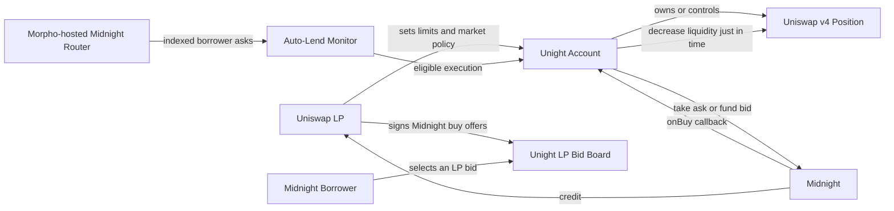

# Unight

> Conditional fixed-rate lending for out-of-range Uniswap v4 liquidity.

Unight gives Uniswap LPs two ways to deploy dormant terminal inventory into Morpho Midnight: **automatically taking qualifying borrower asks**, or **publishing callback-backed lending bids through Unight's own distribution layer**. Both modes settle atomically through Midnight and draw from one shared, policy-controlled LP capacity.

> **Development status:** Unight is an architecture under development. It is not audited or ready for production use.
>
> **Routing status:** As of July 28, 2026, Morpho's hosted Midnight router indexes only offers with empty callbacks. This policy may change, so integrations must validate the current router rules rather than assume they are permanent.

## At a glance

| Item | Unight v1 design |
|---|---|
| Capital source | Single-sided liquidity principal in a fully out-of-range Uniswap v4 position |
| Lending venue | Morpho Midnight fixed-maturity markets |
| Initial loan token | USDC |
| Funding model | Just-in-time through a Midnight buy callback |
| User modes | Auto-Lend and LP Bid Board |
| Settlement | Atomic, on the same chain, through Midnight |
| Position authority | A policy-controlled Unight Account custodies the transferred position NFT and can modify the LP position within policy |
| Initial scope | Approved v4 pools and Midnight markets on Base; no in-callback swaps |

## Why Unight exists

When the pool price moves fully beyond a concentrated-liquidity position's range, the position's **liquidity principal becomes single-sided**: its principal is represented entirely by one of the two pool tokens, subject only to integer rounding. The position stops accruing new ordinary swap fees until the price re-enters the range, but the LP may still want to preserve the range because it could become useful again. Previously accrued fees are accounted for separately and may remain claimable in either token, so **"100% USDC" in this document refers to the withdrawable liquidity principal, not necessarily every token claim associated with the position**.

Without Unight, the LP normally chooses between:

1. **Waiting:** preserve the position and its ability to reactivate, but leave the terminal token idle.
2. **Withdrawing and reallocating:** move the token into lending or another strategy, but give up immediate re-entry into the original range and later pay to rebuild it.

Unight adds a third option:

> Keep the Uniswap position in place while making a bounded portion of its dormant terminal token conditionally available for fixed-rate lending on Midnight.

The inventory follows whichever valid path consumes it first:

- **Uniswap reactivates first:** the position returns to range, its lending capacity falls to zero or is reduced, and it can earn swap fees again.
- **Midnight lending executes first:** Unight removes only the required liquidity, supplies the loan token to Midnight, and the LP receives a fixed-maturity credit position.

Unight is not free double yield. A successful lending fill converts part of the LP's immediately available AMM inventory into credit that remains exposed until it is sold, repaid, withdrawn as available liquidity, or otherwise resolved. Reaching maturity does not itself guarantee immediate cash repayment.

## The terms used in this document

### Terminal inventory

The single token represented by the liquidity principal of a fully out-of-range position. For Unight v1, that token must be the loan token of an approved Midnight market, initially USDC.

For the Base WETH/USDC example used in this document, if WETH's price—quoted as USDC per WETH—is safely above the position's upper price bound, the liquidity principal is entirely USDC. If WETH's price is safely below the lower bound, the principal is entirely WETH. Unight v1 only treats the USDC-side state as eligible. Accrued fees and incidental dust are excluded from the lendable-principal calculation.

The contracts must derive the terminal asset from the pool's canonical currency ordering and tick math; they must not infer it from the human-readable `WETH/USDC` label, which interfaces may display in either price orientation.

### Midnight ask

A borrower-made offer to sell credit or debt units and receive the loan token. In Midnight's offer structure, this is a maker offer with:

```text
offer.buy = false
```

An LP who takes the ask becomes the buyer of credit and therefore the lender.

### Midnight bid

A lender-made offer to buy credit units by supplying the loan token. In Midnight's offer structure, this is a maker offer with:

```text
offer.buy = true
```

A borrower takes the bid and receives the loan token, subject to Midnight's market, collateral, gate, and health rules.

### Buy callback

A contract that Midnight calls during settlement when the buyer of credit must source the loan token just in time. For Unight, the callback removes the required token from the Uniswap position and makes it available to Midnight.

## How Midnight makes Unight possible

Midnight offers are signed instructions, not pre-funded deposits into an order book. A maker can create an offer without first moving the backing token into Midnight.

When an offer is taken, Midnight:

1. validates the offer through its ratifier;
2. calculates the assets and units to exchange;
3. determines who is buying credit and who is selling it;
4. calls the applicable buy callback, if one is supplied;
5. pulls the loan token from the callback or payer;
6. updates the lender's credit and the borrower's debt;
7. enforces the market's final settlement and health conditions.

If the callback cannot provide the token, or any required check fails, the entire transaction reverts. The Uniswap withdrawal and Midnight lending settlement therefore succeed or fail together.

## System overview



Unight is a product composed of contracts and offchain services. It is not only a Uniswap hook and it does not replace Midnight.

### Core components

| Component | Responsibility |
|---|---|
| **Unight Account** | Stores the LP's policy, owns or controls the v4 position, acts as the LP's scoped Midnight-authorized executor, implements the buy callback, and enforces shared capacity. |
| **Uniswap v4 position adapter** | Reads the position, verifies the terminal token and safe out-of-range state, calculates removable liquidity, decreases liquidity, and receives the withdrawn tokens. |
| **Auto-Lend monitor and executor** | Watches supported borrower asks, computes the LP's net rate, simulates execution, and submits a transaction when all stored conditions are satisfied. |
| **LP Bid Board** | Distributes and displays callback-backed Midnight buy offers that Morpho's hosted router does not currently index. |
| **Live capacity service** | Reports how much of an offer is currently executable after accounting for the position, the LP's policy, prior fills, and market state. |
| **Proposed `UnightGuardHook`** | Not implemented in this repository. For future Unight-native v4 pools, it could record time-weighted pool observations that help verify that a position is safely dormant rather than briefly manipulated out of range. |

In the recommended account model, the LP remains the Midnight lender and receives the credit position directly. The LP transfers the position NFT to their personal Unight Account and authorizes only that account to act on their behalf in Midnight. Offchain monitors and keepers can call the account, but they receive no direct authority over the LP's Midnight position or the custodied Uniswap NFT.

## The current Midnight routing limitation

Midnight does not maintain one canonical global order book. Offers can be distributed through a mempool, an RFQ flow, a direct quote, an application, or another onchain or offchain channel. Routers search some of those channels, filter offers according to their own rules, and help takers select an execution plan.

Morpho operates a hosted Midnight router and API. Its current callback policy accepts only offers whose maker callback address and callback data are empty.

That creates the following result for an Unight LP bid:

| Question | Current answer |
|---|---|
| Can the LP create and sign a callback-backed Midnight buy offer? | Yes |
| Can Unight or the LP distribute it directly? | Yes |
| Can a borrower submit it to the Midnight contract? | Yes |
| Can Midnight call Unight, source USDC, and settle it? | Yes |
| Will Morpho's hosted router currently place it in its public bid book? | No |

The blocker is therefore **offer discovery through Morpho's hosted router**, not Midnight settlement.

A callback-backed offer can be valid and executable while remaining invisible to the hosted router. Unight addresses this with two complementary modes.

## Mode 1: Auto-Lend

Auto-Lend lets the borrower speak first.

The LP stores a policy such as:

```text
Use at most:              10,000 USDC
Minimum net lender APR:   7.5%
Approved Midnight market: Market X
Allowed maturity window:  75 to 100 days remaining
Maximum lendable share:   50% of safe terminal inventory
Minimum fill:             1,000 USDC
Policy expiry:            August 31, 2026
```

Unight continuously monitors the borrower asks exposed by the Morpho-hosted router. When an ask satisfies the policy, a permissionless or operated executor asks the LP's Unight Account to take it.

For this mode:

```text
Borrower ask:  offer.buy = false
Borrower:      maker and seller of credit units
LP:            taker, buyer of credit units, and lender
Unight:        supplied as the taker buy callback
```

Midnight then calls Unight's callback, Unight removes the required USDC from the v4 position, and Midnight completes the lending settlement.

### What "automatic" means

Auto-Lend does not mean an onchain contract watches markets by itself. An offchain monitor detects an eligible ask and an executor submits a transaction. The Unight Account independently rechecks every condition onchain, so the monitor cannot lend at an unauthorized rate, maturity, size, or market.

Attractive asks may be consumed by another lender before Unight's transaction is included. Auto-Lend should therefore support partial fills, fresh simulations, deadlines, and fallback asks.

## Mode 2: LP Bid Board

The LP Bid Board lets the LP speak first.

The LP signs a real Midnight buy offer with Unight as its maker callback:

```text
offer.buy:       true
offer.maker:     LP
offer.maxAssets: maximum USDC the LP is willing to lend
offer.market:    approved fixed-maturity Midnight market
offer.tick:      price corresponding to the LP's required rate
offer.callback:  LP's Unight Account
callbackData:    position and policy reference
```

Because the maker callback is non-empty, Morpho's hosted router currently excludes the offer from its indexed bid book. Unight distributes it instead through the LP Bid Board, an API, or a direct RFQ integration.

A borrower can inspect the offer, its current capacity, the Midnight market, the fixed maturity, and a recent settlement simulation. To fill it, the borrower submits the LP's signed offer and ratifier data to the canonical Midnight contract.

For this mode:

```text
LP bid:        offer.buy = true
LP:            maker, buyer of credit units, and lender
Borrower:      taker and seller of credit units
Unight:        stored in offer.callback
```

Midnight validates the signed offer, calls the Unight callback, pulls the sourced USDC, creates or increases the LP's credit, creates or increases the borrower's debt, and enforces the borrower's market conditions.

## Auto-Lend and LP Bid Board compared

| Property | Auto-Lend | LP Bid Board |
|---|---|---|
| Who speaks first? | Borrower | LP |
| Published offer | Borrower ask | LP lending bid |
| Midnight side | `offer.buy = false` | `offer.buy = true` |
| LP role | Taker and lender | Maker and lender |
| Callback location | Runtime `takerCallback` | Signed `offer.callback` |
| Discovery | Morpho-hosted ask books | Unight Bid Board, API, or direct RFQ |
| Who normally submits settlement? | Unight executor | Borrower |
| Who is the taker for fee purposes? | LP | Borrower |
| Does it display Unight capital as public lender depth? | No | Yes, through Unight |
| Main advantage | Works with the current hosted ask router | Lets LPs publish their own price and visible lending capacity |
| Main limitation | LP competes to take borrower asks | Requires Unight to distribute callback-backed offers |

Because the LP is the taker in Auto-Lend, Midnight's settlement spread affects the LP's effective entry price. In the LP Bid Board, the borrower is the taker and the LP receives the maker price. Unight should therefore show a normalized estimated net lender APR after known settlement and continuous fees rather than comparing raw offer ticks.

The same Unight Account and the same buy callback can support both modes. The difference is who created the offer and where the callback is supplied.

## A complete example

The following scenario is illustrative but follows Midnight's actual maker, taker, callback, and fixed-maturity model.

### Starting position

Alice owns a Base Uniswap v4 WETH/USDC position. WETH is trading safely above her position's upper price bound when quoted in USDC per WETH, so the position's withdrawable liquidity principal is entirely USDC. Previously accrued fees, if any, are tracked separately and are not counted toward Unight's lendable capacity.

```text
Withdrawable terminal principal: 20,000 USDC
Global Unight lending cap:        10,000 USDC
Auto-Lend allocation:              6,000 USDC
LP Bid Board allocation:           4,000 USDC
Reactivation reserve:             10,000 USDC
Minimum net lender APR:              7.5%
Approved market maturity:      October 31, 2026
```

Midnight markets have fixed maturity dates. Alice is not creating a fresh three-month loan each time Unight executes. She is authorizing a specific market, or a tightly bounded set of markets, whose remaining time to maturity matches her policy.

### Outcome A: Auto-Lend takes a borrower ask

Bob publishes a Midnight ask for 6,000 USDC in Alice's approved market:

```text
Bob's offer:  buy = false
Bob:          maker and borrower
Alice:        taker and lender
```

1. Morpho's hosted router indexes Bob's empty-callback ask.
2. Unight detects it and calculates an estimated net lender APR above Alice's 7.5% minimum.
3. An executor calls Alice's Unight Account.
4. The account verifies the market, maturity, rate, policy expiry, out-of-range state, and live USDC capacity.
5. The account calls `Midnight.take` with Alice as the taker and the Unight Account as the taker callback.
6. Midnight calls `onBuy` on the Unight Account.
7. Unight decreases enough v4 liquidity to source the required USDC and approves Midnight to pull it.
8. Midnight settles the take, credits Alice, and records Bob's debt subject to Midnight's rules.

Alice has now deployed 6,000 USDC through Auto-Lend. Her Bid Board allocation remains available up to 4,000 USDC.

### Outcome B: a borrower fills Alice's LP bid

Alice also signs a Midnight buy offer for up to 4,000 USDC:

```text
Alice's offer: buy = true
Alice:         maker and lender
Carol:         taker and borrower
Callback:      Alice's Unight Account
```

1. Morpho's hosted router does not index the offer because its maker callback is non-empty.
2. Unight verifies Alice's signature, remaining policy budget, live v4 capacity, and a recent settlement simulation.
3. The LP Bid Board displays 4,000 USDC as currently fillable.
4. Carol selects the offer and submits it to Midnight through the Unight frontend or another compatible client.
5. Midnight validates Alice's ratifier data and calls her Unight Account.
6. Unight removes the required USDC from the v4 position and makes it available to Midnight.
7. Midnight settles the transaction, credits Alice, records Carol's debt, and checks Carol's final position health.

Alice has now deployed her full 10,000 USDC Unight budget while retaining the configured reactivation reserve in the v4 position.

### If Uniswap reactivates first

Suppose the price moves back into Alice's range before either path executes. The position is no longer safely dormant.

Unight must then:

- report zero or reduced live lending capacity;
- refuse new Auto-Lend executions;
- hide, mark unavailable, or simulate-fail affected LP bids;
- reject any stale take inside the callback.

The signed LP bid may still exist as data, but it cannot force Unight to remove liquidity when the onchain policy says the position is unavailable.

## Does the LP Bid Board bypass Midnight?

No. It bypasses only one optional discovery service: Morpho's hosted router.

A useful analogy is:

> The LP Bid Board is a specialized shop window. Midnight remains the cash register, settlement engine, credit ledger, debt ledger, and risk enforcement system.

| Layer | Responsible system |
|---|---|
| Build the LP's offer | Unight frontend using Midnight's offer format |
| Sign and ratify the offer | LP and a Midnight-compatible ratifier |
| Distribute and display the offer | Unight Bid Board or direct RFQ channel |
| Select the offer | Borrower or routing client |
| Validate the offer at execution | Midnight and the offer's ratifier |
| Source the USDC | Unight callback from the v4 position |
| Move the loan token | Midnight |
| Create lender credit and borrower debt | Midnight |
| Enforce gates, collateral, maturity, and health conditions | Midnight |

Unight cannot change a signed offer's market, price, maturity, maximum size, maker, or callback without invalidating the signature or ratifier proof. The borrower still submits the offer to Midnight, and Midnight still decides whether it can settle.

## One position, one shared capacity

Auto-Lend and the LP Bid Board must never be treated as independent claims on the same inventory.

If Alice authorizes 10,000 USDC, Unight cannot safely advertise 10,000 USDC for Auto-Lend and another 10,000 USDC for the Bid Board as if 20,000 USDC were available.

Unight calculates live capacity from a shared budget:

```text
currently fillable = minimum of:

- remaining global Unight policy capacity;
- remaining capacity allocated to the selected mode;
- safely withdrawable loan-token principal;
- the configured lendable percentage;
- the Midnight offer's remaining capacity.
```

For v1, explicit per-mode allocations are the clearest design. For example:

```text
Global cap:       10,000 USDC
Auto-Lend cap:     6,000 USDC
LP Bid cap:        4,000 USDC
```

All critical checks are repeated during the transaction. If two fills race, the first transaction updates the position and shared budget. The second must clamp to the remaining capacity or revert. This prevents double spending, although stale quotes can still cause failed transactions.

## Position authority

Unight cannot source assets unless it can modify the LP's position at settlement time.

The most reliable v1 design is a per-LP Unight Account that holds the v4 position NFT while active policies or bids depend on it. A narrowly scoped delegated-operator design is possible, but it creates more ways for offers to become stale if the owner transfers the NFT, removes liquidity, or revokes approval.

The LP should be able to exit only after dependent policies and signed bids have been invalidated. Offchain removal from the Unight website is not sufficient cancellation; stale signed offers must fail an onchain nonce, budget, authorization, or callback check.

## Safety requirements

| Risk | Required protection |
|---|---|
| Brief price manipulation moves the position just outside range | Range-distance buffer, time-weighted observations, independent reference checks where appropriate, and no same-transaction activation of lending capacity |
| A position re-enters range before settlement | Recheck safe dormancy inside the callback and return zero live capacity beforehand |
| The same inventory is shown in both modes | Shared global capacity, per-mode caps, short-lived quotes, and fresh simulations |
| The LP loses all reactivation inventory | Configurable reactivation reserve and maximum lendable percentage |
| A stale signed bid remains distributed | Short expiry, policy nonce, onchain invalidation, and callback checks |
| Unsupported v4 hook changes withdrawal behavior | Hookless pools or individually reviewed hook addresses only |
| A keeper submits unfavorable terms | Store rate, maturity, market, size, and expiry limits onchain; recheck them before every take |
| Callback is invoked by an unexpected caller | Accept calls only from the canonical Midnight contract and bind the expected LP, position, market, and policy |
| Midnight market performs poorly | Explicit market allowlists and clear disclosure of collateral, oracle, liquidation, maturity, fee, and bad-debt risks |

## Important economic risks

### Adverse selection

The LP is offering conditional access to inventory that may soon become valuable inside Uniswap. Borrowers and executors will naturally prefer to fill when the terms favor them. The lending rate must compensate the LP for credit risk, maturity, fees, and the AMM re-entry option being surrendered.

### Maturity mismatch

A Midnight fill does not temporarily park the USDC. It creates fixed-maturity credit exposure. If the Uniswap range becomes active before the credit can be exited or repaid, the removed inventory is not immediately available to restore the original LP exposure.

### Phantom depth

A displayed bid can become unfillable because the price moved, another mode consumed capacity, the policy was invalidated, or the position changed. Unight must display a live executable amount, not merely the amount originally signed.

### Midnight market risk

After a fill, the LP is a lender in the selected Midnight market. The LP is exposed to that market's collateral, oracle, liquidation, access-gate, fee, maturity, liquidity, and bad-debt behavior.

### Execution competition

In Auto-Lend mode, another lender may consume an attractive borrower ask first. In Bid Board mode, the position may change between quote display and transaction inclusion. Deadlines, fallback offers, partial-fill logic, and simulation reduce these failures but cannot eliminate ordering risk.

## Where the Uniswap v4 hook fits

The core Unight settlement path is a Midnight callback plus authority over a v4 position. A v4 hook is not required to call Midnight.

For a future v4-native implementation, the proposed `UnightGuardHook` could provide a real protocol function: record time-weighted tick and volatility observations for Unight-enabled pools and expose a conservative dormancy check. The Unight Account could use that signal to reject positions that were moved outside range only briefly or manipulatively.

The proposed hook would not hold Midnight credit and would not replace the Unight Account. It would strengthen the evidence that inventory is safely dormant. Existing v4 pools cannot attach a new hook after creation, so production integrations with existing pools may instead use reviewed hookless pools and external reference checks.

## Who Unight is for

Unight is best suited to:

- LPs with meaningful stablecoin-side out-of-range inventory;
- liquidity managers operating several concentrated-liquidity positions;
- vaults that can integrate a policy-controlled Unight strategy module;
- LPs who deliberately place one-sided ranges and want a fixed-rate lending option while waiting.

It is less suitable for very small positions, positions close to immediate re-entry, unsupported terminal tokens, or users who do not want fixed-maturity credit exposure.

## Product summary

> **Unight gives Uniswap LPs two ways to deploy dormant terminal inventory into Midnight: automatically taking qualifying borrower asks, or publishing callback-backed lending bids through Unight's own distribution layer. Both modes settle atomically through Midnight and draw from one shared, policy-controlled LP capacity.**

In plain terms:

- **Auto-Lend** lets Unight find acceptable borrower demand for the LP.
- **LP Bid Board** lets borrowers find acceptable LP capital through Unight.
- **Midnight** validates and settles both forms of lending.
- **Uniswap** remains the capital source until a valid Midnight settlement actually consumes part of the position.

## Technical references

- [Morpho Midnight repository](https://github.com/morpho-org/midnight)
- [Midnight whitepaper](https://morpho.org/whitepapers/midnight-whitepaper.pdf)
- [Midnight offers and callbacks](https://docs.morpho.org/learn/concepts/midnight/offers/)
- [Midnight mempool and router policy](https://docs.morpho.org/developers/midnight/concepts/mempool-router/)
- [Lending by taking Midnight asks](https://docs.morpho.org/developers/midnight/tutorials/lend-at-a-fixed-rate/)
- [Midnight fees](https://docs.morpho.org/developers/midnight/concepts/fees/)
- [Midnight core settlement contract](https://github.com/morpho-org/midnight/blob/main/src/Midnight.sol)
- [Uniswap v4 PositionManager](https://github.com/Uniswap/v4-periphery/blob/main/src/PositionManager.sol)
